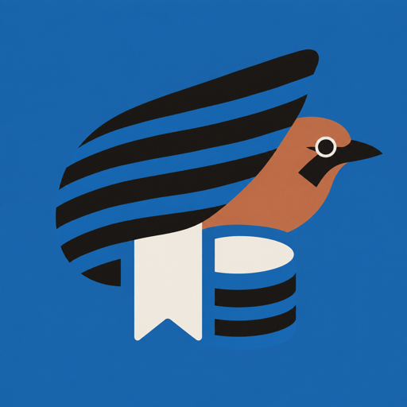

<p align="center">
  
</p>

<h1 align="center">Kakesu</h1>

<p align="center">放り込んで、あとで掘り出す。iOS 用ブックマークアプリ「Kakesu」の公開 Web サイトです。</p>

<p align="center">
  <a href="https://fukuidinotech.github.io/kakesu-lp/">https://fukuidinotech.github.io/kakesu-lp/</a>
</p>

## 構成

**8言語。ja は repo 直下、ほかは同名のサブディレクトリ。**
公開済みの `…/kakesu-lp/` を動かさないため、ja だけディレクトリを持ちません。

```
kakesu-lp/
├── index.html features.html guide.html terms.html privacy.html contact.html   ← ja
├── en/ de/ fr/ es/ ko/ zh-Hans/ zh-Hant/   ← 各6ページ（同じファイル名）
├── style.css  icon-512.png                 ← 全言語で共有（1つだけ置く）
├── shots/<言語>/                           ← 操作画像は言語ごと（ja も shots/ja/）
└── tools/i18n.py                           ← 共通部分の正本
```

### 共通部分は手で書かない

各ページの `<head>` の alternate、ヘッダー（ナビ・言語切替）、フッターは
**`tools/i18n.py` が生成します。** HTML 内の目印のあいだは上書きされます。

```
<!--chrome:alt-->  …  <!--/chrome:alt-->    canonical / hreflang / css
<!--chrome:head--> …  <!--/chrome:head-->   サイトヘッダーと言語切替
<!--chrome:foot--> …  <!--/chrome:foot-->   サイトフッター
```

```
python3 tools/i18n.py           # 全ページに書き戻す
python3 tools/i18n.py --check   # ずれていたら異常終了（/lp-sync が使う）
```

手で書くのは `<title>` と `<meta name="description">`、そして本文だけです。
新しいページを足すときは `tools/mk.py` で骨組みを作ってから `i18n.py` を通します。

**言語を足す／減らすときは 3 か所を同時に直します。**
`tools/i18n.py` の `LANGS`、アプリの `Kakesu/Services/SiteLinks.swift`、
`fastlane/metadata/<locale>/marketing_url.txt`（と `support_url.txt`）。
